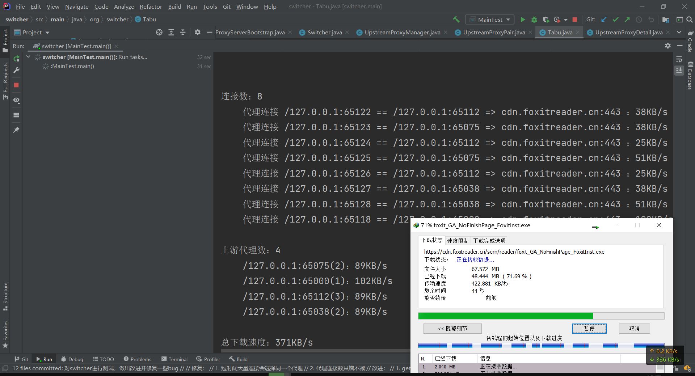

# switcher

一个基于特定策略选择代理的代理软件

# 使用

## 示例

MainTest.java

```java
import org.littleshoot.proxy.impl.DefaultHttpProxyServer;
import org.switcher.*;

import java.net.InetSocketAddress;
import java.util.List;

public class MainTest {
    public static void main(String[] args) throws Exception {
        // 校园网每人的下载速度限制
        int downloadSpeedLimit = 100 * 1024;
        // 舍友数量^_^
        int numberOfProxies = 3;

        SwitcherHttpProxyServer switcherHttpProxyServer = SwitcherHttpProxyServer.bootstrap()
                .withDirectProxyThrottling(downloadSpeedLimit, 0)
                .start();
        Switcher switcher = switcherHttpProxyServer.switcher;
        ConnectionManager connectionManager = switcher.connectionManager;
        UpstreamProxyManager upstreamProxyManager = switcher.upstreamProxyManager;

        for (int i = 0; i < numberOfProxies; i++) {
            // 舍友i
            InetSocketAddress listenAddress = DefaultHttpProxyServer.bootstrap()
                    .withName("舍友" + i)
                    .withPort(0)
                    .withThrottling(downloadSpeedLimit, 0)
                    .start().getListenAddress();
            // 把代理加入到switcher中
            upstreamProxyManager.add(listenAddress);
        }

        // TODO 在下载器（如IDM）启动多个下载任务，设置代理为switcher

        while (true) {
            // 每过1秒输出一次下载速度
            Thread.sleep(1000);
            // 清屏
            StringBuilder cls = new StringBuilder();
            for (int i = 0; i < 10; i++) {
                cls.append("\n");
            }
            System.out.println(cls);
            // 输出
            List<ConnectionPair> connectionPairs = connectionManager.getAll();
            List<UpstreamProxyPair> upstreamProxyPairs = upstreamProxyManager.getAll();

            System.out.println("连接数：" + connectionPairs.size());
            connectionPairs.forEach(connectionPair ->
                    System.out.println("    " + ConnectionManager.connectionChain(connectionPair) +
                            "：" + connectionPair.connectionDetail.speedRecorder.getPrettySpeed()));
            System.out.println();
            System.out.println("上游代理数：" + upstreamProxyPairs.size());
            upstreamProxyPairs.forEach(upstreamProxyPair ->
                    System.out.println("    " + upstreamProxyPair.proxySocket + "(" +
                            upstreamProxyPair.upstreamProxyDetail.getRelevantConnectionSize() + ")" +
                            "：" + upstreamProxyPair.upstreamProxyDetail.speedRecorder.getPrettySpeed()));
            System.out.println();
            System.out.println("总下载速度：" + switcher.speedRecorder.getPrettySpeed());
        }
    }
}
```

在代码中，限制了4个端口（包括Switcher自身直连）的下载速度为100KB/s，当进行多线程下载时，switcher能合理分配任务给其它代理（可以是宿舍里其它舍友开启的服务），因此速度就能大幅度提升。


